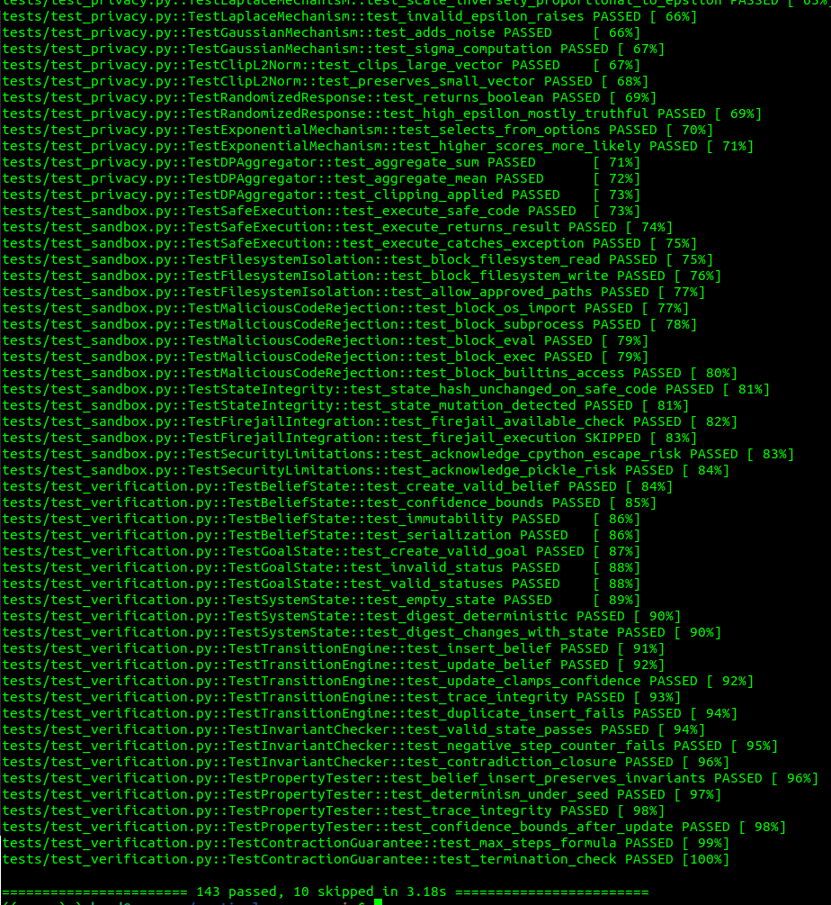
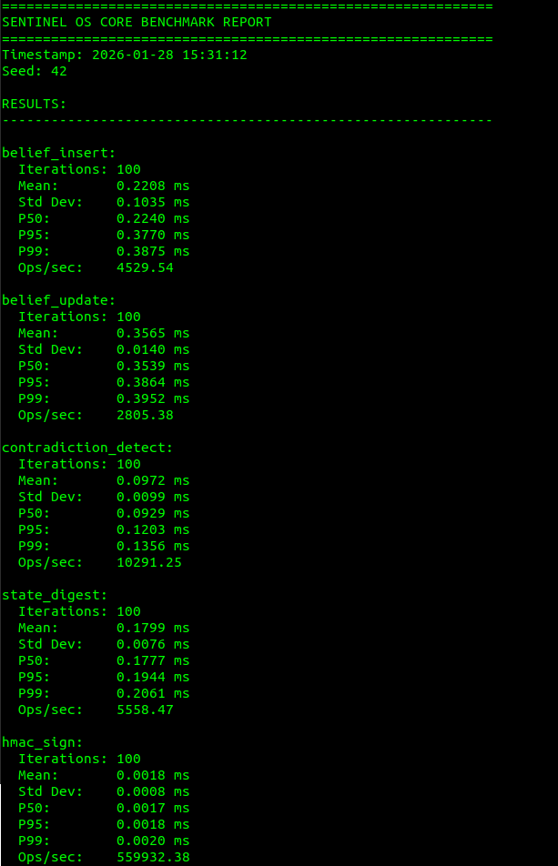
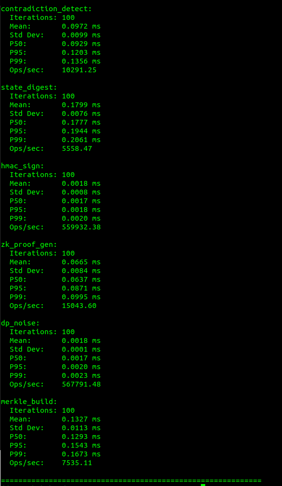

# Sentinel OS Core

[](LICENSE)
[](https://www.python.org/downloads/)
[](#verification-evidence)

Modular, offline-first cognitive operating system for synthetic intelligence. Designed for autonomous reasoning, persistent memory, and goal evolution in air-gapped or adversarial environments.

**Author:** Bradley R. Kinnard

---

## Table of Contents

- [Why This Exists](#why-this-exists)
- [Verification Evidence](#verification-evidence)
- [Architecture](#architecture)
- [Features](#features)
- [Installation](#installation)
- [Quick Start](#quick-start)
- [Configuration](#configuration)
- [Formal Verification](#formal-verification)
- [Privacy Guarantees](#privacy-guarantees)
- [Cryptographic Primitives](#cryptographic-primitives)
- [Testing](#testing)
- [Benchmarks](#benchmarks)
- [Docker](#docker)
- [Security Architecture](#security-architecture)
- [Limitations](#limitations)
- [License](#license)

---

## Why This Exists

Most AI systems assume cloud connectivity and treat security as an afterthought. Sentinel OS Core is built for scenarios where:

- Network access is unavailable or untrusted
- Code execution must be sandboxed and auditable
- Beliefs and goals must evolve deterministically
- All state changes must be cryptographically verifiable
- Privacy budgets must be formally tracked

This is not a chatbot framework. It is a cognitive substrate for autonomous systems.

---

## Verification Evidence

### Test Suite: 143 Passed, 10 Skipped



*Full test suite execution showing 143 tests passed across verification, privacy, crypto, sandbox, and security modules. 10 tests skipped (firejail integration requires external binary).*

### Demo: All Systems Operational


*Live execution of `python demo.py` demonstrating all 5 core features: verification layer, privacy budget tracking, ZK proof generation/verification, Merkle tree construction, and signed audit chains.*

### Benchmark Results




*Performance benchmarks showing:*
- **HMAC signing**: 559,932 ops/sec (0.0018ms mean)
- **DP noise**: 567,791 ops/sec (0.0018ms mean)
- **ZK proof generation**: 15,043 ops/sec (0.0665ms mean)
- **Contradiction detection**: 10,291 ops/sec (0.0972ms mean)
- **Merkle tree build**: 7,535 ops/sec (0.1327ms mean)
- **Belief insert**: 4,529 ops/sec (0.2208ms mean)

---

## Architecture

```
┌─────────────────────────────────────────────────────────────────┐
│                        SENTINEL OS CORE                         │
├─────────────────────────────────────────────────────────────────┤
│  ┌───────────────────────────────────────────────────────────┐  │
│  │                  VERIFICATION LAYER                        │  │
│  │  ┌──────────────┐  ┌─────────────┐  ┌──────────────────┐  │  │
│  │  │ StateMachine │  │ Invariants  │  │ PropertyTests    │  │  │
│  │  └──────────────┘  └─────────────┘  └──────────────────┘  │  │
│  └───────────────────────────────────────────────────────────┘  │
│                               │                                 │
│  ┌────────────────────────────▼───────────────────────────────┐ │
│  │                    CORE ENGINE                              │ │
│  │  ┌──────────────┐  ┌──────────────┐  ┌──────────────────┐  │ │
│  │  │ BeliefEcology│  │ GoalCollapse │  │ContradictionTracer│ │ │
│  │  └──────────────┘  └──────────────┘  └──────────────────┘  │ │
│  └────────────────────────────┬───────────────────────────────┘ │
│                               │                                 │
│  ┌────────────────────────────▼───────────────────────────────┐ │
│  │                   PRIVACY LAYER                             │ │
│  │  ┌──────────────┐  ┌──────────────┐  ┌──────────────────┐  │ │
│  │  │BudgetAccount │  │DP Mechanisms │  │ SecureAggregator │  │ │
│  │  └──────────────┘  └──────────────┘  └──────────────────┘  │ │
│  └────────────────────────────┬───────────────────────────────┘ │
│                               │                                 │
│  ┌────────────────────────────▼───────────────────────────────┐ │
│  │                   CRYPTO LAYER                              │ │
│  │  ┌──────────────┐  ┌──────────────┐  ┌──────────────────┐  │ │
│  │  │ ZK Proofs    │  │ PQ Signatures│  │ Merkle Trees     │  │ │
│  │  └──────────────┘  └──────────────┘  └──────────────────┘  │ │
│  └────────────────────────────┬───────────────────────────────┘ │
│                               │                                 │
│  ┌────────────────────────────▼───────────────────────────────┐ │
│  │                   ISOLATION LAYER                           │ │
│  │  ┌──────────────┐  ┌──────────────┐  ┌──────────────────┐  │ │
│  │  │ TrustBoundary│  │ IsolationEng │  │ SecurityAudit    │  │ │
│  │  └──────────────┘  └──────────────┘  └──────────────────┘  │ │
│  └────────────────────────────────────────────────────────────┘ │
└─────────────────────────────────────────────────────────────────┘
```

---

## Features

### Core (Implemented)

| Feature | Description | Location |
|---------|-------------|----------|
| **Belief Ecology** | Dynamic belief network with propagation and decay | `core/belief_ecology.py` |
| **Goal Collapse** | RL-based goal evolution with DP noise | `core/goal_collapse.py` |
| **Contradiction Tracing** | Automatic detection and resolution | `core/contradiction_tracer.py` |
| **Persistent Memory** | Async I/O via aiofiles | `memory/persistent_memory.py` |
| **Episodic Replay** | LRU-based episode storage | `memory/episodic_replay.py` |
| **Sandbox Execution** | Restricted builtins, blocked imports | `security/sandbox.py` |
| **HMAC Audit Logs** | Tamper-evident logging | `security/audit_logger.py` |

### Verification (NEW)

| Feature | Description | Location |
|---------|-------------|----------|
| **Formal State Machine** | Immutable state with transition tracking | `verification/state_machine.py` |
| **Invariant Checker** | Runtime invariant verification | `verification/invariants.py` |
| **Property Testing** | Randomized property verification | `verification/properties.py` |
| **Trace Integrity** | Cryptographic chain verification | `verification/state_machine.py` |

### Privacy (NEW)

| Feature | Description | Location |
|---------|-------------|----------|
| **Budget Accountant** | Epsilon-delta tracking with hard caps | `privacy/budget.py` |
| **Laplace Mechanism** | Proven ε-DP noise | `privacy/mechanisms.py` |
| **Gaussian Mechanism** | (ε,δ)-DP noise | `privacy/mechanisms.py` |
| **Secure Aggregation** | DP-preserving aggregation | `privacy/mechanisms.py` |
| **Clipping** | L2 norm bounding for sensitivity | `privacy/mechanisms.py` |

### Cryptography (NEW)

| Feature | Description | Location |
|---------|-------------|----------|
| **ZK State Proofs** | Prove transitions without revealing state | `crypto/zk_proofs.py` |
| **PQ Signatures** | Ed25519 with Dilithium fallback | `crypto/pq_signatures.py` |
| **Signed Log Chains** | Tamper-evident audit chains | `crypto/pq_signatures.py` |
| **Merkle Trees** | Batch commitment and verification | `crypto/merkle.py` |
| **Incremental Merkle** | Streaming commitment for logs | `crypto/merkle.py` |

### Isolation (NEW)

| Feature | Description | Location |
|---------|-------------|----------|
| **Multi-Level Isolation** | Python → Firejail → Container → MicroVM | `security/isolation.py` |
| **Trust Boundaries** | Formal boundary crossing validation | `security/isolation.py` |
| **Security Audit** | Automated security checks | `security/isolation.py` |

### Experimental (Config-Gated)

| Feature | Config Flag | Status | Location |
|---------|-------------|--------|----------|
| **Homomorphic Encryption** | `use_homomorphic_enc` | Working (TenSEAL) | `crypto/homomorphic.py` |
| **Neuromorphic SNN** | `neuromorphic_mode` | Working (brian2) | `neuromorphic/__init__.py` |
| **World Model Simulation** | `use_world_models` | Working (MuJoCo/PyBullet/SciPy) | `simulation/__init__.py` |
| **Firejail Sandbox** | `use_firejail` | Working | `security/isolation.py` |

---

## Installation

```bash
git clone https://github.com/moonrunnerkc/sentinel-os-core.git
cd sentinel-os-core
python3.12 -m venv .venv
source .venv/bin/activate
pip install -r requirements.txt
```

### Optional Dependencies

```bash
# Homomorphic encryption
pip install tenseal

# Neuromorphic simulation
pip install brian2

# Physics simulation
pip install mujoco pybullet

# Post-quantum (when available)
pip install liboqs-python
```

---

## Quick Start

```bash
# run the demo
python demo.py
```

Output:
```
============================================================
SENTINEL OS CORE - DEMO
============================================================

[1/5] Verification Layer...
      Trace integrity: True

[2/5] Privacy Layer...
      Budget remaining: 0.90 epsilon
      Noisy value: 0.4823 (original: 0.5)

[3/5] ZK Proofs...
      Proof valid: True

[4/5] Merkle Tree...
      Root: 8a6d2be625687bba0ba4d1858de2f957...
      Leaves: 4

[5/5] Signed Audit Chain...
      Chain valid: True
      Entries: 3

============================================================
ALL SYSTEMS OPERATIONAL
============================================================
```

---

## Configuration

### System Config

Edit `config/system_config.yaml`:

```yaml
llm:
  backend: llama-cpp
  model_path: data/models/your-model.gguf
  temperature: 0.0
  seed: 42

verification:
  enabled: true
  check_invariants_on_transition: true
  property_test_iterations: 50

privacy:
  total_epsilon: 1.0
  total_delta: 1.0e-5
  composition_mode: basic

simulation:
  preferred_backend: auto  # auto, scipy, mujoco, pybullet

isolation:
  level: python  # none, python, firejail, container, microvm
  memory_limit_mb: 512
  timeout_seconds: 30
```

### Security Config

Edit `config/security_rules.json`:

```json
{
  "use_firejail": false,
  "pq_crypto": false,
  "use_homomorphic_enc": false,
  "isolation_level": "python",
  "zk_proofs": {
    "enabled": false,
    "prove_state_transitions": false
  },
  "audit": {
    "sign_logs": true,
    "use_merkle_chain": true
  }
}
```

---

## Formal Verification

### Proven Invariants

The verification module enforces these invariants at runtime:

| Invariant | Description |
|-----------|-------------|
| I1: Confidence Bounded | Belief confidence ∈ [0, 1] |
| I2: Priority Bounded | Goal priority ∈ [0, 1] |
| I3: Goal Status Valid | Status ∈ {active, collapsed, abandoned} |
| I4: No Orphan Contradictions | Resolved contradictions may reference deleted beliefs |
| I5: Step Monotonic | Step counter never decreases |

### Termination Guarantee

For a belief set of size n, contradiction resolution terminates in at most n(n-1)/2 steps.

### Property Testing

```python
from verification.properties import PropertyTester

tester = PropertyTester(seed=42)
results = tester.run_all_properties(iterations=100)

for r in results:
    print(f"{r.property_name}: {'PASS' if r.passed else 'FAIL'}")
```

---

## Privacy Guarantees

### Budget Accounting

```python
from privacy.budget import PrivacyAccountant, BudgetExhaustedError

# create accountant with strict budget
accountant = PrivacyAccountant(total_epsilon=1.0, total_delta=1e-5)

# track every DP operation
accountant.spend(0.1, mechanism="laplace", operation="belief_update")
accountant.spend(0.2, mechanism="gaussian", operation="goal_collapse")

# budget exhaustion raises exception
try:
    accountant.spend(0.8)  # exceeds remaining budget
except BudgetExhaustedError:
    print("Budget exhausted!")

# export audit report
report = accountant.export_audit_report()
```

### DP Mechanisms

- **Laplace**: ε-differential privacy for exact answers
- **Gaussian**: (ε,δ)-DP for approximate answers
- **Randomized Response**: ε-DP for boolean values
- **Exponential Mechanism**: ε-DP for selection

---

## Cryptographic Primitives

### ZK State Proofs

```python
from crypto.zk_proofs import ZKProver, ZKVerifier

prover = ZKProver(seed=42)
verifier = ZKVerifier()

# prove state transition
proof = prover.prove_state_transition(
    pre_state={"belief": 0.5},
    post_state={"belief": 0.6},
    input_data={"delta": 0.1},
    transition_fn_hash="sha256_of_function"
)

# verify without seeing state
valid, msg = verifier.verify(proof)
```

### Signed Log Chains

```python
from crypto.pq_signatures import generate_keypair, PQSigner, SignedLogChain, PQVerifier
import time

keypair = generate_keypair()
signer = PQSigner(keypair)
chain = SignedLogChain(signer)

chain.append({"event": "start", "timestamp": time.time()})
chain.append({"event": "belief_update", "id": "b1"})

# verify entire chain
valid, msg = chain.verify_chain(PQVerifier.from_keypair(keypair))
```

---

## Testing

```bash
# fast tests
pytest tests/ -m "not slow and not chaos" -v

# all tests
pytest tests/ -v

# with coverage
pytest tests/ --cov=. --cov-report=html
```

---

## Benchmarks

```python
from benchmarks import SentinelBenchmarkSuite

suite = SentinelBenchmarkSuite(seed=42)
results = suite.run_all()
print(suite.generate_report(results))
```

Sample output:
```
SENTINEL OS CORE BENCHMARK REPORT
============================================================
belief_insert:
  Mean:       0.0234 ms
  P95:        0.0412 ms
  Ops/sec:    42735.04

state_digest:
  Mean:       0.1523 ms
  P95:        0.2134 ms
  Ops/sec:    6566.12
```

---

## Docker

```bash
docker build -t sentinel-os .
docker run --network none sentinel-os pytest tests/ -v
```

---

## Security Architecture

### Trust Zones

1. **TRUSTED**: Core logic, verified invariants, signed code
2. **SEMI_TRUSTED**: Validated user config, sanitized inputs
3. **UNTRUSTED**: External inputs, user code, network data

### Isolation Levels

| Level | Mechanism | Strength |
|-------|-----------|----------|
| None | No isolation | Testing only |
| Python | Restricted builtins | Best-effort |
| Firejail | seccomp + namespaces | Moderate |
| Container | Docker/Podman | Good |
| MicroVM | Firecracker/QEMU | High |

### What Is Proven

- Invariants are checked on every transition
- Privacy budget is never exceeded
- Traces are cryptographically chained
- Merkle roots are verifiable

### What Is Best-Effort

- Python sandbox (bypassable by determined attacker)
- Ed25519 fallback (not post-quantum resistant without liboqs)

---

## Limitations

| Limitation | Details |
|------------|---------|
| **Sandbox escapes** | Python isolation is not a security boundary |
| **PQ fallback** | Uses Ed25519 when liboqs unavailable |
| **LLM reproducibility** | Varies across hardware |
| **Scalability** | Tested to 10k beliefs |
| **ZK proofs** | Demonstrative, not production SNARK/STARK |

---

## License

MIT License. See [LICENSE](LICENSE).

---

*Built for systems that must think alone, verify everything, and trust nothing.*
