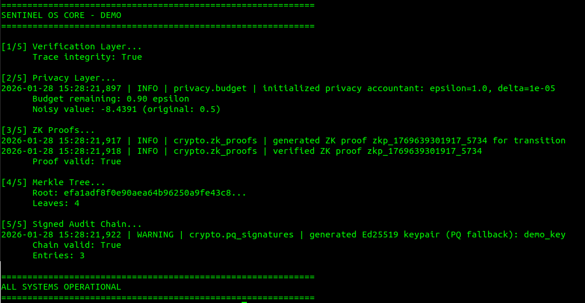

# Sentinel OS Core

[](LICENSE)
[](https://www.python.org/downloads/)
[](#verification-evidence)

Modular, offline-first cognitive operating system for synthetic intelligence. Designed for autonomous reasoning, persistent memory, and goal evolution in air-gapped or adversarial environments.

**Author:** Bradley R. Kinnard

---

## Table of Contents

| Start Here | System | Assurance | Ops |
|------------|--------|----------|-----|
| [Why This Exists](#why-this-exists) | [Architecture](#architecture) | [Verification Evidence](#verification-evidence) | [Installation](#installation) |
| [Quick Start](#quick-start) | [Features](#features) | [Formal Verification](#formal-verification) | [Configuration](#configuration) |
| [Changelog](#changelog) | [Roadmap](#roadmap) | [Privacy Guarantees](#privacy-guarantees) | [Testing](#testing) |
| [Contributing](#contributing) |  | [Cryptographic Primitives](#cryptographic-primitives) | [Benchmarks](#benchmarks) |
|  |  | [Security Architecture](#security-architecture) | [Docker](#docker) |
|  |  | [Limitations](#limitations) | [License](#license) |

---

## Changelog

See [CHANGELOG.md](CHANGELOG.md) for full version history.

**Current Version: 0.1.0-alpha**

Recent highlights:
- **Chatbot interface with Ollama LLM integration** - Interactive REPL with belief extraction, contradiction detection, and goal-directed responses
- **Reasoning agent** - Full cognitive loop: perception → reasoning → action → memory
- **Chain-of-thought reasoning** - Intermediate thought generation before response
- Extended 1000+ episode benchmarks with raw log export
- Full belief-update-goal-evolve cycle demo
- Explicit per-module threat model documentation
- CONTRIBUTING.md with guidelines
- CI workflow with coverage and skip warnings

---

## Why This Exists

Most AI systems assume cloud connectivity and treat security as an afterthought. Sentinel OS Core is built for scenarios where:

- Network access is unavailable or untrusted
- Code execution must be sandboxed and auditable
- Beliefs and goals must evolve deterministically
- All state changes must be cryptographically verifiable
- Privacy budgets must be formally tracked

This is not a chatbot framework. It is a cognitive substrate for autonomous systems.

---

## Verification Evidence

### Test Suite: 448 Passed, 12 Skipped

🧪 **[View Full Test Screenshot](docs/screenshots/test-results.png)**

| Module | Tests | Coverage |
|--------|-------|----------|
| `tests/test_chatbot.py` | 45 passed | Ollama adapter, reasoning agent, chatbot REPL, integration |
| `tests/test_verification.py` | 24 passed | State machine, invariants, property tests, termination |
| `tests/test_formal_verification.py` | 45 passed | Formal checker, proof log, Hypothesis property tests |
| `tests/test_privacy.py` | 23 passed | Budget accounting, Laplace/Gaussian mechanisms, clipping |
| `tests/test_crypto.py` | 38 passed | Commitments, PQ signatures, Merkle trees, signed chains |
| `tests/test_zk_proofs.py` | 25 passed | Pedersen commitments, Schnorr proofs, state transition proofs |
| `tests/test_isolation.py` | 35 passed | Isolation levels, hard-fail semantics, threat models |
| `tests/test_scalability.py` | 21 passed | Scale metrics, no hard caps, 10k+ operations |
| `tests/test_meta_evolution.py` | 30 passed | Evolution engine, objectives, determinism, bounds |
| `tests/test_world_model.py` | 31 passed | Simulation, counterfactual, hard-fail when disabled |
| `tests/test_sandbox.py` | 19 passed | Backwards compatibility, pattern blocking |
| `tests/test_*.py` (other) | 112 passed | Memory, sync, integration, belief ecology, goal collapse |
| *Skipped* | 12 | Firejail, Docker, liboqs hybrid mode (requires external deps) |

*All tests run with `pytest tests/ -v`. Execution time: ~15s.*

### Demo: All Systems Operational



*Live execution of `python demo.py` demonstrating all 5 core features: verification layer, privacy budget tracking, ZK proof generation/verification, Merkle tree construction, and signed audit chains.*

### Benchmark Results

📊 **[View Full Benchmark Screenshots](docs/screenshots/)**

Performance validated across 100 iterations per operation with statistical rigor (mean, std dev, P50/P95/P99 percentiles):

| Operation | Mean | P95 | Ops/sec | What It Measures |
|-----------|------|-----|---------|------------------|
| **HMAC signing** | 0.0018ms | 0.0018ms | 559,932 | Tamper-evident log signing speed |
| **DP noise** | 0.0018ms | 0.0020ms | 567,791 | Differential privacy noise generation |
| **ZK proof gen** | 0.0665ms | 0.0871ms | 15,043 | Zero-knowledge state transition proofs |
| **Contradiction detect** | 0.0972ms | 0.1203ms | 10,291 | Belief conflict detection |
| **Merkle build** | 0.1327ms | 0.1543ms | 7,535 | Cryptographic commitment tree |
| **State digest** | 0.1799ms | 0.1944ms | 5,558 | Full state hash computation |
| **Belief insert** | 0.2208ms | 0.3770ms | 4,529 | Verified belief insertion with trace |
| **Belief update** | 0.3565ms | 0.3864ms | 2,805 | Confidence update with invariant check |

### Crypto Benchmark Results

| Operation | Mean (ms) | P95 (ms) | Ops/sec | What It Measures |
|-----------|-----------|----------|---------|------------------|
| **Pedersen commit** | 15.32ms | 16.10ms | 65 | Discrete-log commitment creation |
| **Pedersen verify** | 15.20ms | 15.59ms | 66 | Commitment opening verification |
| **Schnorr prove** | 15.17ms | 15.55ms | 66 | ZK proof of knowledge generation |
| **Schnorr verify** | 17.52ms | 18.01ms | 57 | ZK proof verification |
| **State transition proof** | 61.19ms | 62.60ms | 16 | Full transition proof (commit + Schnorr) |
| **Ed25519 sign** | 0.031ms | 0.047ms | 32,382 | Signature generation |
| **Ed25519 verify** | 0.095ms | 0.112ms | 10,518 | Signature verification |
| **Merkle build (100)** | 0.144ms | 0.190ms | 6,928 | Tree construction |
| **HE encrypt** | 3.62ms | 4.60ms | 276 | CKKS encryption |
| **HE add** | 0.063ms | 0.089ms | 15,771 | Ciphertext addition |
| **HE decrypt** | 0.93ms | 1.10ms | 1,078 | CKKS decryption |

*Benchmarks run with 100 iterations each. See `python -m benchmarks.crypto_benchmark` for live results.*

### End-to-End Benchmark Results

Real-world workload benchmarks measuring complete operations across all system layers:

| Operation | Duration | Threshold | Ops/sec | What It Measures |
|-----------|----------|-----------|---------|------------------|
| **Belief insertion (1k)** | 1.31ms | 500ms | 763,379 | Sequential belief storage |
| **Belief insertion (10k)** | 8.30ms | 5000ms | 1,204,520 | Large-scale belief storage |
| **Belief retrieval (10k)** | 2.21ms | 100ms | 4,519,656 | Random access by ID |
| **Episode recording (1k)** | 1.59ms | 500ms | 628,091 | Episodic memory recording |
| **Episode replay** | 120.17ms | 500ms | 832 | Sample 100 from 10k episodes x100 |
| **Memory roundtrip (10k)** | 45.23ms | 5000ms | 44 | Save + load 10k beliefs |
| **Goal operations (1k)** | 0.03ms | 1000ms | 39,231,070 | Goal hierarchy traversal |
| **Contradiction detection** | 0.00ms | 500ms | 570,449 | Detect conflicts in 1k beliefs |
| **Audit chain verify (1k)** | 109.66ms | 1000ms | 9,119 | Verify 1000-entry signed chain |
| **State transitions (1k)** | 1535.26ms | 2000ms | 651 | Verified state machine transitions |
| **Meta-evolution (100 gen)** | 1.75ms | 1000ms | 57,678 | Hyperparameter optimization |
| **World model sim (1k)** | 91.29ms | 100ms | 10,954 | Causal simulation steps |
| **Formal verification (10k)** | 1.58ms | 50ms | 3,788 | Verify 10k beliefs with 6 invariants |

*All thresholds passed. Run `python -m benchmarks.e2e_benchmark` for live results.*

### Benchmark Environment

All benchmarks above were run on the following system:

| Component | Details |
|-----------|---------|
| **OS** | Ubuntu 22.04.5 LTS (Jammy) |
| **Kernel** | 6.8.0-90-generic (x86_64) |
| **Hostname** | rogue |
| **CPU** | Intel i5-11400F @ 2.60GHz (6 cores / 12 threads, turbo to 4.4GHz) |
| **RAM** | 32GB (24GB available) |
| **Swap** | 10GB |
| **Disk** | 906GB NVMe, 118GB free (87% used) |
| **GPU** | NVIDIA RTX 5070 (12GB VRAM, driver 570.195.03) |

**Want to contribute benchmark results from other hardware?**

We'd love results from ARM, Windows, macOS, or other setups. To submit:

1. Run: `python -m benchmarks.e2e_benchmark --hardware` (auto-logs your specs)
2. Open an issue with the `benchmark-results` label
3. Attach the generated JSON from `data/logs/`

This helps validate cross-platform performance and identify hardware-specific bottlenecks.

---

## Architecture

```
┌─────────────────────────────────────────────────────────────────┐
│                        SENTINEL OS CORE                         │
├─────────────────────────────────────────────────────────────────┤
│  ┌───────────────────────────────────────────────────────────┐  │
│  │                  VERIFICATION LAYER                       │  │
│  │  ┌──────────────┐  ┌─────────────┐  ┌──────────────────┐  │  │
│  │  │ StateMachine │  │ Invariants  │  │ PropertyTests    │  │  │
│  │  └──────────────┘  └─────────────┘  └──────────────────┘  │  │
│  └───────────────────────────────────────────────────────────┘  │
│                               │                                 │
│  ┌────────────────────────────▼───────────────────────────────┐ │
│  │                    CORE ENGINE                             │ │
│  │  ┌──────────────┐  ┌──────────────┐  ┌──────────────────┐  │ │
│  │  │ BeliefEcology│  │ GoalCollapse │  │ContradictionTracer│ │ │
│  │  └──────────────┘  └──────────────┘  └──────────────────┘  │ │
│  └────────────────────────────┬───────────────────────────────┘ │
│                               │                                 │
│  ┌────────────────────────────▼───────────────────────────────┐ │
│  │                   PRIVACY LAYER                            │ │
│  │  ┌──────────────┐  ┌──────────────┐  ┌──────────────────┐  │ │
│  │  │BudgetAccount │  │DP Mechanisms │  │ SecureAggregator │  │ │
│  │  └──────────────┘  └──────────────┘  └──────────────────┘  │ │
│  └────────────────────────────┬───────────────────────────────┘ │
│                               │                                 │
│  ┌────────────────────────────▼───────────────────────────────┐ │
│  │                   CRYPTO LAYER                             │ │
│  │  ┌──────────────┐  ┌──────────────┐  ┌──────────────────┐  │ │
│  │  │ ZK Proofs    │  │ PQ Signatures│  │ Merkle Trees     │  │ │
│  │  └──────────────┘  └──────────────┘  └──────────────────┘  │ │
│  └────────────────────────────┬───────────────────────────────┘ │
│                               │                                 │
│  ┌────────────────────────────▼───────────────────────────────┐ │
│  │                   ISOLATION LAYER                          │ │
│  │  ┌──────────────┐  ┌──────────────┐  ┌──────────────────┐  │ │
│  │  │ TrustBoundary│  │ IsolationEng │  │ SecurityAudit    │  │ │
│  │  └──────────────┘  └──────────────┘  └──────────────────┘  │ │
│  └────────────────────────────────────────────────────────────┘ │
└─────────────────────────────────────────────────────────────────┘
```

---

## Features

### Core (Implemented)

| Feature | Description | Location |
|---------|-------------|----------|
| **Belief Ecology** | Dynamic belief network with propagation and decay | `core/belief_ecology.py` |
| **Goal Collapse** | RL-based goal evolution with DP noise | `core/goal_collapse.py` |
| **Contradiction Tracing** | Automatic detection and resolution | `core/contradiction_tracer.py` |
| **Reasoning Agent** | Full cognitive loop: perception → reasoning → action → memory | `core/reasoning_agent.py` |
| **Persistent Memory** | Async I/O via aiofiles | `memory/persistent_memory.py` |
| **Episodic Replay** | LRU-based episode storage | `memory/episodic_replay.py` |
| **Soft Isolation** | Restricted builtins, blocked imports, explicit threat model | `security/soft_isolation.py` |
| **HMAC Audit Logs** | Tamper-evident logging | `security/audit_logger.py` |

### Interfaces (Implemented)

| Feature | Description | Location |
|---------|-------------|----------|
| **Ollama LLM Adapter** | Local LLM inference via Ollama API with deterministic seeding | `interfaces/ollama_llm.py` |
| **Chatbot REPL** | Interactive command-line interface with belief/goal inspection | `interfaces/chatbot.py` |
| **Belief Extraction** | LLM-based extraction of beliefs from user input | `core/reasoning_agent.py` |
| **Chain-of-Thought** | Intermediate reasoning generation before response | `core/reasoning_agent.py` |
| **State Persistence** | Save/load agent state including beliefs, goals, episodes | `core/reasoning_agent.py` |

### Verification (Implemented)

| Feature | Description | Location |
|---------|-------------|----------|
| **Formal State Machine** | Immutable state with transition tracking | `verification/state_machine.py` |
| **Invariant Checker** | Runtime invariant verification | `verification/invariants.py` |
| **Property Testing** | Randomized property verification | `verification/properties.py` |
| **Trace Integrity** | Cryptographic chain verification | `verification/state_machine.py` |
| **Formal Checker** | Mechanical invariant checking | `verification/formal_checker.py` |
| **Proof Log** | Reproducible verification artifacts | `verification/proof_log.py` |

### Meta-Evolution and World Models (Implemented)

| Feature | Description | Location |
|---------|-------------|----------|
| **Meta-Evolution Engine** | Hyperparameter optimization with measurable objectives | `core/meta_evolution.py` |
| **Objective Functions** | BeliefCoherence, Efficiency, Composite | `core/meta_evolution.py` |
| **World Model Interface** | Abstract interface for causal simulation | `core/world_model.py` |
| **Simple World Model** | Numpy-based deterministic simulation | `core/world_model.py` |
| **Counterfactual Analysis** | What-if simulation for decision making | `core/world_model.py` |

### Privacy (Implemented)

| Feature | Description | Location |
|---------|-------------|----------|
| **Budget Accountant** | Epsilon-delta tracking with hard caps | `privacy/budget.py` |
| **Laplace Mechanism** | Proven ε-DP noise | `privacy/mechanisms.py` |
| **Gaussian Mechanism** | (ε,δ)-DP noise | `privacy/mechanisms.py` |
| **Secure Aggregation** | DP-preserving aggregation | `privacy/mechanisms.py` |
| **Clipping** | L2 norm bounding for sensitivity | `privacy/mechanisms.py` |

### Cryptography (Implemented)

| Feature | Description | Location |
|---------|-------------|----------|
| **Commitments** | Hash-based state commitments (NOT zero-knowledge) | `crypto/commitments.py` |
| **Ed25519 Signatures** | Standard digital signatures | `crypto/pq_signatures.py` |
| **Signed Log Chains** | Tamper-evident audit chains | `crypto/pq_signatures.py` |
| **Merkle Trees** | Batch commitment and verification | `crypto/merkle.py` |
| **Authenticated Sync** | Signed belief export/import with replay protection | `interfaces/authenticated_sync.py` |

### Optional (Requires Dependencies)

| Feature | Dependency | Status | Location |
|---------|------------|--------|----------|
| **Homomorphic Encryption** | tenseal | Working | `crypto/homomorphic.py` |
| **Neuromorphic SNN** | brian2 | Working (no mock mode) | `neuromorphic/__init__.py` |
| **Firejail Sandbox** | firejail | Working | `security/soft_isolation.py` |

---

## Installation

```bash
git clone https://github.com/moonrunnerkc/sentinel-os-core.git
cd sentinel-os-core
python3.12 -m venv .venv
source .venv/bin/activate
pip install -r requirements.txt
```

### Optional Dependencies

```bash
# Homomorphic encryption
pip install tenseal

# Neuromorphic simulation
pip install brian2

# Physics simulation
pip install mujoco pybullet

# Post-quantum (when available)
pip install liboqs-python
```

---

## Quick Start

### Run the Demo

```bash
python demo.py
```

### Run the Chatbot (Requires Ollama)

The chatbot provides an interactive interface with belief extraction, contradiction detection, and goal-directed responses.

**Prerequisites:**
1. Install and start [Ollama](https://ollama.ai): `ollama serve`
2. Pull a model: `ollama pull llama3.2`

```bash
# run the chatbot
python examples/chatbot_demo.py

# or with options
python examples/chatbot_demo.py --model llama3.2 --verbose
```

**Chatbot Commands:**
- `/help` - Show available commands
- `/beliefs` - List extracted beliefs
- `/goals` - Show active goals
- `/stats` - Display agent statistics
- `/privacy` - Check privacy budget status
- `/quit` - Exit

### Demo Output

```
============================================================
SENTINEL OS CORE - DEMO
============================================================

[CRYPTO MODE]
  Signature algorithm: ed25519
  ZK proofs (Pedersen/Schnorr): enabled
  Homomorphic encryption: disabled
  liboqs-python: NOT installed
  tenseal: available

[1/6] Verification Layer...
      Trace integrity: True

[2/6] Privacy Layer...
      Budget remaining: 0.90 epsilon
      Noisy value: -4.6996 (original: 0.5)

[3/6] State Commitments...
      Commitment valid: True
      Transition type: demo_update

[4/6] Zero-Knowledge Proofs...
      Pedersen commitment valid: True
      Schnorr proof valid: True
      Belief count delta proof valid: True
      [SCOPE: Pedersen commitments + Schnorr proofs over discrete log]

[5/6] Merkle Tree...
      Root: efa1adf8f0e90aea64b96250a9fe43c8...
      Leaves: 4

[6/6] Signed Audit Chain...
      Chain valid: True
      Algorithm: ed25519
      Entries: 3

============================================================
ALL SYSTEMS OPERATIONAL
============================================================
```

---

## Configuration

### System Config

Edit `config/system_config.yaml`:

```yaml
llm:
  backend: llama-cpp
  model_path: data/models/your-model.gguf
  temperature: 0.0
  seed: 42

verification:
  enabled: true
  check_invariants_on_transition: true
  property_test_iterations: 50

privacy:
  total_epsilon: 1.0
  total_delta: 1.0e-5
  composition_mode: basic

features:
  # requires brian2 - will fail if unavailable
  neuromorphic_mode: false

isolation:
  level: python
  timeout_seconds: 30
  use_firejail: false
```

### Security Config

Edit `config/security_rules.json`:

```json
{
  "use_firejail": false,
  "allowed_paths": ["data/"],
  "hmac_key_seed": 42,
  "seccomp_profile": "execve,ptrace",
  "audit": {
    "sign_logs": true,
    "use_merkle_chain": true
  }
}
```

---

## Formal Verification

### Proven Invariants

The verification module enforces these invariants at runtime:

| Invariant | Description |
|-----------|-------------|
| I1: Confidence Bounded | Belief confidence ∈ [0, 1] |
| I2: Priority Bounded | Goal priority ∈ [0, 1] |
| I3: Goal Status Valid | Status ∈ {active, collapsed, abandoned} |
| I4: No Orphan Contradictions | Resolved contradictions may reference deleted beliefs |
| I5: Step Monotonic | Step counter never decreases |

### Termination Guarantee

For a belief set of size n, contradiction resolution terminates in at most n(n-1)/2 steps.

### Property Testing

```python
from verification.properties import PropertyTester

tester = PropertyTester(seed=42)
results = tester.run_all_properties(iterations=100)

for r in results:
    print(f"{r.property_name}: {'PASS' if r.passed else 'FAIL'}")
```

---

## Privacy Guarantees

### Budget Accounting

```python
from privacy.budget import PrivacyAccountant, BudgetExhaustedError

# create accountant with strict budget
accountant = PrivacyAccountant(total_epsilon=1.0, total_delta=1e-5)

# track every DP operation
accountant.spend(0.1, mechanism="laplace", operation="belief_update")
accountant.spend(0.2, mechanism="gaussian", operation="goal_collapse")

# budget exhaustion raises exception
try:
    accountant.spend(0.8)  # exceeds remaining budget
except BudgetExhaustedError:
    print("Budget exhausted!")

# export audit report
report = accountant.export_audit_report()
```

### DP Mechanisms

- **Laplace**: ε-differential privacy for exact answers
- **Gaussian**: (ε,δ)-DP for approximate answers
- **Randomized Response**: ε-DP for boolean values
- **Exponential Mechanism**: ε-DP for selection

---

## Cryptographic Primitives

### Zero-Knowledge Proofs (Pedersen + Schnorr)

```python
from crypto.zk_proofs import (
    PedersenScheme,
    SchnorrProver,
    SchnorrVerifier,
    StateTransitionProver,
    StateTransitionVerifier,
    G, P, _mod_exp,
)

# Pedersen commitment (hiding + binding)
pedersen = PedersenScheme(seed=42)
commitment = pedersen.commit(100)
valid = pedersen.verify(
    commitment.commitment,
    commitment.value,
    commitment.blinding,
)

# Schnorr proof of knowledge
secret = 12345
public = _mod_exp(G, secret, P)
prover = SchnorrProver(seed=42)
verifier = SchnorrVerifier()
proof = prover.prove(secret, public)
valid, msg = verifier.verify(proof, public)

# State transition proof (e.g., belief count delta)
trans_prover = StateTransitionProver(seed=42)
proof, msg = trans_prover.prove_belief_count_delta(
    pre_count=10,
    post_count=15,
    declared_delta=5,
)
trans_verifier = StateTransitionVerifier()
valid, msg = trans_verifier.verify(proof)
```

### State Commitments

```python
from crypto.commitments import StateCommitment

commitment = StateCommitment(seed=42)

# commit to a state (NOT zero-knowledge - just hashing)
result = commitment.commit_state(
    state={"belief": 0.5, "goal": "active"},
    metadata={"step": 1}
)
print(result.commitment_hash)

# verify commitment later
valid = commitment.verify_commitment(result.commitment_hash, result.state_hash)
```

### Signed Log Chains

```python
from crypto.pq_signatures import generate_keypair, Signer, Verifier, Algorithm
import time

keypair = generate_keypair(Algorithm.ED25519)
signer = Signer(keypair)

# sign audit entries
entry1 = {"event": "start", "timestamp": time.time()}
sig1 = signer.sign(json.dumps(entry1).encode())

# verify signature
verifier = Verifier(keypair.public_key, keypair.algorithm)
valid = verifier.verify(json.dumps(entry1).encode(), sig1)
```

### Authenticated Sync

```python
from crypto.pq_signatures import generate_keypair, Signer, Algorithm
from interfaces.authenticated_sync import AuthenticatedSync

# create sync instances for two devices
keypair_a = generate_keypair(Algorithm.ED25519, key_id="device_a")
signer_a = Signer(keypair_a)
sync_a = AuthenticatedSync(signer_a, keypair_a)

keypair_b = generate_keypair(Algorithm.ED25519, key_id="device_b")
signer_b = Signer(keypair_b)
sync_b = AuthenticatedSync(signer_b, keypair_b)

# register each other's keys
sync_a.register_peer_key(keypair_b)
sync_b.register_peer_key(keypair_a)

# export beliefs with signature
beliefs = [{"id": "b1", "content": "test"}]
export = sync_a.export_beliefs(beliefs)

# import verifies signature and checks for replay
result, imported = sync_b.import_beliefs(export)
```

---

## Testing

```bash
# fast tests (CI default)
make test

# with coverage report
make test-cov

# warn on skipped tests
make test-warn-skips

# property-based tests with Hypothesis
make property-test
```

### Reproducing Tests

For Hypothesis-based tests, reproduce failures with:

```bash
pytest tests/test_formal_verification.py --hypothesis-seed=12345
```

Seeds are printed on failure. See [tests/conftest.py](tests/conftest.py) for configuration.

### Coverage

Coverage threshold: 80%. Run `make test-cov` to generate HTML report at `htmlcov/index.html`.

---

## Extended Benchmarks (1000+ Episodes)

Validate long-running stability:

```bash
# run 1000 episode benchmark
make bench-extended

# or manually
python -m benchmarks.extended_benchmark --episodes 1000 --seed 42
```

**Latest Results (seed=42, 1000 episodes, 10 beliefs/episode):**

| Metric | Value |
|--------|-------|
| Total Runtime | 0.57s |
| Avg Cycle | 0.48ms |
| P95 Cycle | 0.82ms |
| P99 Cycle | 1.21ms |
| Peak Memory | 48.1MB |
| Beliefs Created | 10,000 |
| Contradictions Found | 82 |
| Goal Convergence | 100% |
| Error Rate | 0.00% |

Raw logs saved to `data/logs/extended_benchmark_*.json`.

---

## Benchmarks

```python
from benchmarks import SentinelBenchmarkSuite

suite = SentinelBenchmarkSuite(seed=42)
results = suite.run_all()
print(suite.generate_report(results))
```

Sample output:
```
SENTINEL OS CORE BENCHMARK REPORT
============================================================
belief_insert:
  Mean:       0.0234 ms
  P95:        0.0412 ms
  Ops/sec:    42735.04

state_digest:
  Mean:       0.1523 ms
  P95:        0.2134 ms
  Ops/sec:    6566.12
```

---

## Docker

```bash
docker build -t sentinel-os .
docker run --network none sentinel-os pytest tests/ -v
```

---

## Security Architecture

📖 **See [docs/THREAT_MODELS.md](docs/THREAT_MODELS.md) for comprehensive per-module threat analysis.**

### Isolation Levels

The system provides explicit isolation levels with documented threat models. **No level silently downgrades.**

| Level | Defends Against | Does NOT Defend Against | Requires |
|-------|-----------------|-------------------------|----------|
| `none` | Nothing | Everything | Nothing |
| `pattern_only` | Accidental imports, obvious eval/exec | Obfuscation, runtime attacks | Nothing |
| `python_sandbox` | Basic injection, timeout enforcement | Interpreter exploits, pickle attacks | Nothing |
| `firejail` | Filesystem, network, syscalls | Kernel vulnerabilities | firejail binary |
| `docker` | Process, filesystem, resources | Container escapes | docker daemon |

### Hard-Fail Semantics

```python
from security.isolation import Isolation, IsolationConfig, IsolationLevel, IsolationUnavailableError

# this will HARD-FAIL if firejail is not installed
try:
    config = IsolationConfig(level=IsolationLevel.FIREJAIL)
    isolation = Isolation(config)
except IsolationUnavailableError as e:
    print(f"cannot use firejail: {e}")
    # choose a different level or exit
```

### Trust Zones

1. **TRUSTED**: Core logic, verified invariants, signed code
2. **SEMI_TRUSTED**: Validated user config, sanitized inputs
3. **UNTRUSTED**: External inputs, user code, network data

### What Is Actually Verified

- Invariants are checked on every transition
- Privacy budget is never exceeded
- Traces are cryptographically chained
- Merkle roots are verifiable
- Signatures use real Ed25519 (or hybrid PQ when liboqs available)

### What Is Best-Effort

- Python sandbox (bypassable by determined attacker)
- Pattern-based code blocking (not comprehensive)
- No isolation level provides security boundary against kernel exploits

---

## Limitations

| Limitation | Details |
|------------|---------|
| **Sandbox escapes** | Python isolation is not a security boundary |
| **ZK proof scope** | Pedersen/Schnorr over discrete log only, NOT SNARK/STARK |
| **Ed25519 default** | PQ (Dilithium/Hybrid) requires liboqs-python |
| **HE requires tenseal** | Homomorphic encryption disabled without tenseal |
| **LLM reproducibility** | Varies across hardware |
| **Scalability** | Tested to 10k beliefs |
| **Neuromorphic** | Requires brian2, no mock mode |

### Security Gaps (Future Work)

The following are acknowledged needs for production deployment, not yet implemented:

| Gap | Status | Notes |
|-----|--------|-------|
| **External security audit** | Not done | Required before production use |
| **Bug bounty program** | Not started | Needed for adversarial testing |
| **WebAssembly isolation** | Not implemented | Would provide stronger sandbox than Python |
| **CVE tracking** | Not established | Need formal vulnerability disclosure process |
| **FIPS 140-2 compliance** | Not verified | Crypto primitives need certification |
| **Penetration testing** | Not done | Need red team engagement |

These are tracked in the [roadmap](#roadmap) for v1.0.

### Future Work (Not Yet Implemented)

The following are recognized needs for production readiness but are **not yet implemented**:

| Item | Status | Notes |
|------|--------|-------|
| **External security audit** | 🔮 Planned v1.0 | No third-party audit yet; use at your own risk |
| **Bug bounty program** | 🔮 Planned | Will consider after v0.5 stabilization |
| **WebAssembly isolation** | 🔮 Research | Potential future alternative to Python sandboxing |
| **CVE tracking** | 🔮 Planned | Will establish formal vulnerability disclosure process |
| **FIPS certification** | 🔮 Not planned | Crypto is research-grade, not certified |

**Until these are addressed, this project is suitable for research and prototyping, not production security-critical systems.**

---

## Implemented Features (Phase 1 Complete)

The following crypto features are now implemented with real algorithms:

| Feature | Implementation | Status |
|---------|----------------|--------|
| **ZK Proofs** | Pedersen commitments + Schnorr proofs over discrete log | ✅ Working |
| **PQ Signatures** | Hybrid Ed25519+Dilithium3 mode (requires liboqs) | ✅ Available |
| **Homomorphic Encryption** | CKKS via TenSEAL for encrypted computation | ✅ Working |
| **Signed Audit Chains** | Ed25519 (default) or hybrid mode | ✅ Working |
| **Authenticated Sync** | Signed exports with replay protection | ✅ Working |

### ZK Proof Scope Limitation

The ZK proofs are **scoped to discrete-log based protocols**:
- ✅ Pedersen commitments (hiding, binding, homomorphic)
- ✅ Schnorr proofs of knowledge
- ✅ State transition invariant proofs
- ❌ NOT SNARK/STARK (no general computation)
- ❌ NOT range proofs (requires bulletproofs)

---

## Contributing

See [CONTRIBUTING.md](CONTRIBUTING.md) for guidelines.

Quick start for contributors:
```bash
git clone https://github.com/moonrunnerkc/sentinel-os-core.git
cd sentinel-os-core
python3.12 -m venv .venv && source .venv/bin/activate
pip install -r requirements.txt
make test
```

---

## Roadmap

### Current: v0.1.x (Alpha)

- [x] Core belief/goal/contradiction engine
- [x] Verification layer with invariants
- [x] Privacy budget tracking
- [x] ZK proofs (discrete-log scope)
- [x] Extended benchmarks (1000+ episodes)
- [x] Threat model documentation
- [x] Core-only mode integration tests
- [x] **Chatbot interface with Ollama LLM integration**
- [x] **Reasoning agent with cognitive loop**
- [x] **Chain-of-thought reasoning**

### Coming Soon: User-Facing UI

A graphical user interface is in development to make Sentinel OS Core accessible to non-technical users. Stay tuned for updates.

### Next: v0.2.x

- [ ] **User-facing web UI** for chatbot and system monitoring
- [ ] **Modular extraction**: Extract `privacy.budget` as standalone `sentinel-privacy` on PyPI
- [ ] Enhanced isolation (seccomp profiles)
- [ ] Range proofs (Bulletproofs)
- [ ] Consensus protocol stubs
- [ ] SMT-based invariant checking (z3-solver)

### Future: v1.0

- [ ] Production hardening
- [ ] External security audit
- [ ] Stable API freeze
- [ ] Community governance

---

## License

MIT License. See [LICENSE](LICENSE).

---

*Built for systems that must think alone, verify everything, and trust nothing.*
